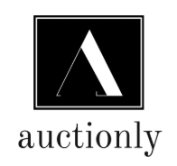

<h1 align="center">
    
</h1>

<p align="center">
	
  
	
  <a href="https://www.linkedin.com/in/carolina-vasconcelos/">
    
  </a>
  
  <a href="https://github.com/carolvasc/auctionly/commits/master">
    
  </a>

  
   <a href="https://github.com/carolvasc/auctionly/stargazers">
    
  </a>
</p>

<p align="center">
  <a href="#-Projeto">Projeto</a>&nbsp;&nbsp;&nbsp;|&nbsp;&nbsp;&nbsp;
  <a href="#rocket-Tecnologias">Tecnologias</a>&nbsp;&nbsp;&nbsp;|&nbsp;&nbsp;&nbsp;
  <a href="#information_source-Como-usar">Como usar</a>&nbsp;&nbsp;&nbsp;|&nbsp;&nbsp;&nbsp;
  <a href="#raising_hand-Criar-usuario">Criar usuário</a>
</p>

## 💻 Projeto

<p>O auctionly é uma aplicação web para leilões online.</p>
<p>Nessa primeira versão, já é possível realizar o CRUD (Create, Read, Update, Delete) dos leilões.</p>
<p>Também possui autenticação de usuário e não permite que os desativados acessem o sistema.</p>

## :rocket: Tecnologias

Esse projeto foi desenvolvido com as seguintes tecnologias:

- [Angular][angular]
- [PO UI][poui]
- [TypeScript][typescript]
- [Node.js][nodejs]
- [Express][express]
- [MongoDB][mongodb]


## :information_source: Como usar

Para clonar essa aplicação, você precisar ter o [Git](https://git-scm.com), [Node.js][nodejs] + [Npm][npm] instalados no seu computador.

Para utilizar o banco de dados você deverá instalar o [MongoDB][mongodb] e configurá-lo de acordo com o seu sistema operacional.

Do seu terminal:

```bash
# Clone esse repositório
$ git clone https://github.com/carolvasc/auctionly
```

### Configure a API 

```bash
# Acesse o repositório
$ cd auctionly/backend

# Instale as dependencias
$ npm install

# Start o server
$ node src/server.js

# rodando na porta 3000
```

### Configure o Front-end

```bash
# Acesse o repositório
$ cd auctionly/frontend

# Instale as dependencias
$ npm install

# Start o front
$ ng serve

# rodando na porta 4200
```

## :raising_hand: Criar usuário

Como foi dito na descrição do projeto, você precisará de um usuário para acessar o sistema e como esse módulo ainda não está finalizado você só conseguirá criá-lo seguindo os passos abaixo:

- Utilize alguma ferramenta de testes de serviços RESTful.
Algumas sugestões são o [Postman][postman], que possui até uma versão para navegador, não precisando instalar no computador ou o [Insomnia][insomnia].

- Crie uma requisição do tipo POST e:

  - Na URL da requisição insira `http://localhost:3000/auth/register/`

  - Copie e cole o objeto abaixo no body da requisição, e altere os dados que desejar
    ```json
    {
      "name": "seu nome",
      "login": "seulogin",
      "password": "suasenha",
      "active": true
    }
    ```
  - Se tudo correr bem, deverá ser retornado um objeto com os dados inseridos e agora você já pode utiliza-lo para logar na aplicação.

_**OBS:** Não recomendo criar o usuário diretamente na collection pois a senha está sendo criptografada pela API e isso irá interferir no processo de login._

[angular]: https://angular.io/
[mongodb]: https://www.mongodb.com/
[nodejs]: https://nodejs.org/
[express]: https://expressjs.com/pt-br/
[typescript]: https://www.typescriptlang.org/
[npm]: https://docs.npmjs.com/downloading-and-installing-node-js-and-npm
[postman]: https://www.postman.com/
[insomnia]: https://insomnia.rest/download/
[poui]: https://po-ui.io/
